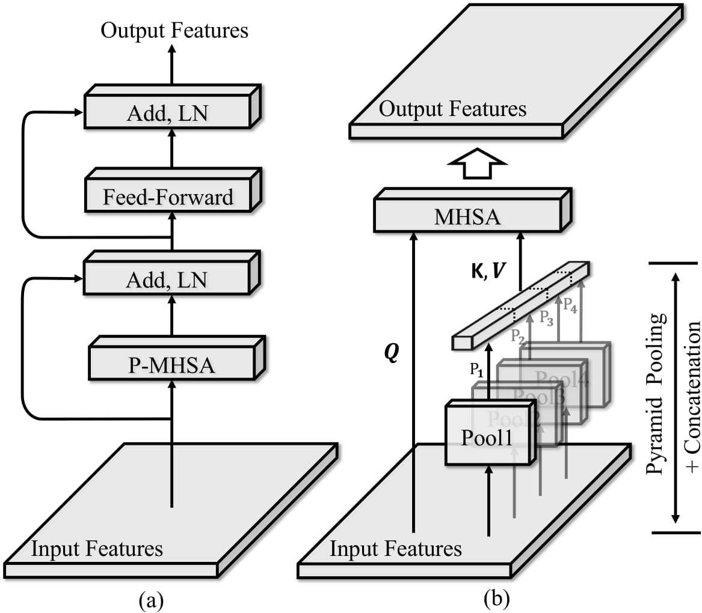

## [TPAMI22] Pyramid Pooling Transformer for Scene Understanding

This is the official repository for Pyramid Pooling Transformer (P2T). This repository contains:

* [x] Full code for training/test 
* [x] Pretrained models in image classification, object detection, and semantic segmentation.

### Requirements:

* torch 1.7+
* torchvision 0.7.0+
* timm==0.3.2

### Introduction

Pyramid pooling transformer (P2T) is a new generation backbone network,, benefiting many fundamental downstream vision tasks like object detection, semantic segmentation, and instance segmentation.

Although pyramid pooling has demonstrated its power on many downstream tasks such as object detection (SPP) and semantic segmentation (PSPNet), it has not been explored on the backbone network, which serves a cornerstone for many downstream vision tasks. 
P2T first bridges the gap between pyramid pooling and backbone network.
The core idea is P2T is adapting pyramid pooling to the downsampling of the flatten sequences in computing the self-attention, 
simultaneously reducing the sequence length and capturing powerful multi-scale contextual features.
Pyramid pooling is also very efficient and will only induce negligible computational cost.

In the experiments, P2T beats all the CNN/Transformer competitors such as ResNet, ResNeXt, Res2Net, PVT, Swin, Twins, and PVTv2, on image classification, semantic segmentation, object detection, and instance segmentation.



### Image Classification

|     Variants     | Input  Size    | Acc Top-1 | Acc Top-5 | #Params (M) | # GFLOPS | Google Drive |
|:---------------:|:---------:|:-----:|:-----:|:-----------:|:-----------------:|-----------------|
| P2T-Tiny   | 224 x 224 | 79.8 | 94.9 |    11.6    |    1.8    | [[weights]](https://drive.google.com/file/d/1x9EweWx77pXrHOCc7RJF3sYK2rht0_4m/view?usp=sharing)\|[[log]](https://drive.google.com/file/d/1CDofCg9pi0Cyiha_dIimggF228M5mOeH/view?usp=sharing) |
| P2T-Small  | 224 x 224 |  82.4 | 96.0 |    24.1    |    3.7    | [[weights]](https://drive.google.com/file/d/1FlwhyVKw0zqj2mux248gIQFQ8DGPi8rS/view?usp=sharing)\|[[log]](https://drive.google.com/file/d/1bCZz7y0I0EEw74KaVg5iAr3hBYtSIEii/view?usp=sharing) |
| P2T-Base | 224 x 224 |  83.5 | 96.6 |     36.2    |    6.5    |    [[weights]](https://drive.google.com/file/d/1iZoWexUTPUDSIZiJHNRt2zZl2kFj68F4/view?usp=sharing)\|[[log]](https://drive.google.com/file/d/13_XaX0XtYSzPatVl54ihFbEwflHLVvsl/view?usp=sharing)    |
| P2T-Large | 224 x 224 | 83.9 | 96.7 | 54.5 | 9.8 | [[weights]](https://drive.google.com/file/d/13jBJ7ShDJd1juViC-zPtfLXYPRwkNfya/view?usp=sharing)\|[[log]](https://drive.google.com/file/d/1-RLjGzez-_O2_8obbXvUYGhWacPnqK1U/view?usp=sharing) |

All models are trained on ImageNet1K dataset. You can see all weights/logs at this url: [[Google Drive]](https://drive.google.com/drive/folders/1Osweqc1OphwtWONXIgD20q9_I2arT9yz?usp=sharing)

### Semantic Segmentation

#### ADE20K (val set)

|  Base Model    | Variants  | mIoU | aAcc | mAcc | #Params (M) | # GFLOPS |                         Google Drive                         |
| :--: | :-------: | :--: | :--: | :---------: | :------: | :----------------------------------------------------------: | :----------------------------------------------------------: |
| Semantic FPN    | P2T-Tiny  | 43.4 | 80.8 |    54.5    |    15.4    |   31.6   | [[weights & logs]](https://drive.google.com/drive/folders/1SH9zmdGKvnpFBVU3dXS6-TZT04CZgkX9?usp=sharing) |
| Semantic FPN    | P2T-Small | 46.7 | 82.0 |    58.4    |    27.8    |   42.7   | [[weights & logs]](https://drive.google.com/drive/folders/1SH9zmdGKvnpFBVU3dXS6-TZT04CZgkX9?usp=sharing) |
| Semantic FPN    | P2T-Base  | 48.7 | 82.9 |    60.7    |    39.8    |   58.5   | [[weights & logs]](https://drive.google.com/drive/folders/1SH9zmdGKvnpFBVU3dXS6-TZT04CZgkX9?usp=sharing) |
| Semantic FPN      | P2T-Large | 49.4 | 83.3 |    61.9    |    58.1    |   77.7   | [[weights & logs]](https://drive.google.com/drive/folders/1SH9zmdGKvnpFBVU3dXS6-TZT04CZgkX9?usp=sharing) |

The training and validation scripts can refer to the `segmentation` folder.

### Object Detection

Tested on the coco validation set


| Base Model | Variants  |  AP  | AP@0.5 | AP@0.75 | #Params (M) | # GFLOPS |
| :--------: | :-------: | :--: | :----: | :-----: | :---------: | :------: |
| RetinaNet  | P2T-Tiny  | 41.3 |  62.0  |  44.1   |    21.1     |   206    |
| RetinaNet  | P2T-Small | 44.4 |  65.3  |  47.6   |    33.8     |   260    |
| RetinaNet  | P2T-Base  | 46.1 |  67.5  |  49.6   |    45.8     |   344    |
| RetinaNet  | P2T-Large | 47.2 |  68.4  |  50.9   |    64.4     |   449    |

Use this address to access all pretrained weights and logs: [[Google Drive]](https://drive.google.com/drive/folders/1fcg7n3Ga8cYoT-3Ar0PeQXjAC3AnQYyY?usp=sharing)

### Instance Segmentation 

Tested on the coco val set


| Base Model | Variants  | APb  | APb@0.5 | APm  | APm@0.5 | #Params (M) | # GFLOPS |
| :--------: | :-------: | :--: | :-----: | :--: | :-----: | :---------: | :------: |
| Mask R-CNN | P2T-Tiny  | 43.3 |  65.7   | 39.6 |  62.5   |    31.3     |   225    |
| Mask R-CNN | P2T-Small | 45.5 |  67.7   | 41.4 |  64.6   |    43.7     |   279    |
| Mask R-CNN | P2T-Base  | 47.2 |  69.3   | 42.7 |  66.1   |    55.7     |   363    |
| Mask R-CNN | P2T-Large | 48.3 |  70.2   | 43.5 |  67.3   |    74.0     |   467    |

`APb` denotes AP box metric, and `APm` is the AP mask metric.

Use this address to access all pretrained weights and logs: [[Google Drive]](https://drive.google.com/drive/folders/1fcg7n3Ga8cYoT-3Ar0PeQXjAC3AnQYyY?usp=sharing)

### Train

Use the following commands to train `P2T-Small` for distributed learning with 8 GPUs:

````bash
python -m torch.distributed.launch --nproc_per_node=8 \
    --master_port=$((RANDOM+10000)) --use_env main.py --data-path ${YOUR_DATA_PATH} --batch-size 128 --model p2t_small --drop-path 0.1
# model names: --model p2t_tiny/p2t_small/p2t_base/p2t_large
# with --drop-path 0.1/0.1/0.3/0.3
# replace ${YOUR_DATA_PATH} with your data path that contains train/ val/ directory
````

### Validate the performance

Download the pretrained weights to `pretrained` directory first. Then use the following commands to validate the performance:

````bash
python main.py --eval --resume pretrained/p2t_small.pth --model p2t_small
````

### Citation

If you are using the code/model/data provided here in a publication, please consider citing our works:

````
@ARTICLE{wu2022p2t,
  author={Wu, Yu-Huan and Liu, Yun and Zhan, Xin and Cheng, Ming-Ming},
  journal={IEEE Transactions on Pattern Analysis and Machine Intelligence}, 
  title={{P2T}: Pyramid Pooling Transformer for Scene Understanding}, 
  year={2022},
  doi = {10.1109/tpami.2022.3202765},
}
````

### Other Notes

If you meet any problems, please do not hesitate to contact us.
Issues and discussions are welcome in the repository!
You can also contact us via sending messages to this email: wuyuhuan@mail.nankai.edu.cn


### License

This code is released under the Creative Commons Attribution-NonCommercial-ShareAlike 4.0 International Public License for Non-Commercial use only. Any commercial use should get formal permission first.

